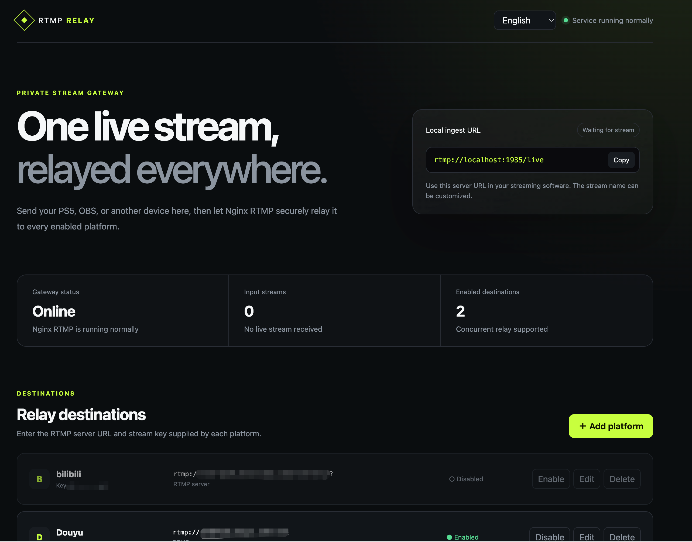
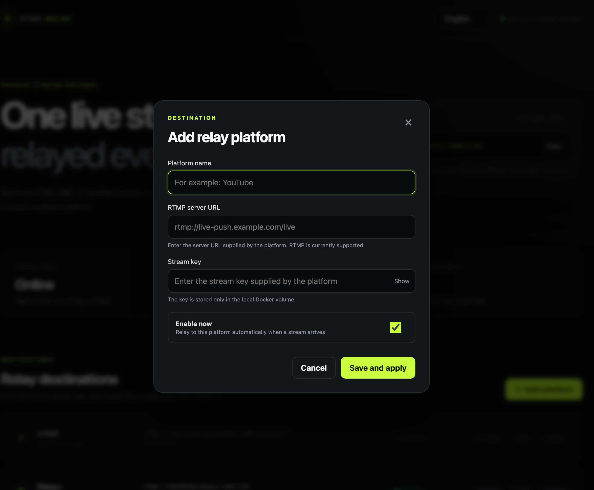

# RTMP Relay Manager

[](https://github.com/raykimurayyz/nginx-rtmp/actions/workflows/ci.yml)
[](https://hub.docker.com/r/raykimurayyz/nginx-rtmp)
[](https://hub.docker.com/r/raykimurayyz/nginx-rtmp/tags)
[](LICENSE)

[中文说明](README.zh-CN.md) · [Docker Hub](https://hub.docker.com/r/raykimurayyz/nginx-rtmp)

A self-hosted web interface that receives one RTMP stream and relays it to multiple streaming platforms. Send video from OBS, a PlayStation 4/5 or Xbox streaming setup, a camera, a hardware encoder, or any other RTMP-capable source, then manage every destination from your browser.



## Why use it?

- **Stream once, relay everywhere.** One local input can be forwarded to multiple RTMP platforms simultaneously.
- **No manual NGINX editing.** Add, edit, enable, disable, and remove destinations from the web interface.
- **See what is happening.** Monitor input/output bitrate, transferred traffic, media metadata, active streams, and RTMP connections.
- **Keep configuration across upgrades.** Destinations and stream keys live in a Docker-managed volume, not in the disposable container.
- **Use it in your language.** English, Japanese, and Simplified Chinese are supported and selected automatically on first use.
- **Stay self-hosted.** No cloud account or external control service is required.

## How it works

```text
OBS / PlayStation or Xbox setup / camera / RTMP encoder
                          |
                          | one RTMP stream
                          v
                RTMP Relay Manager
                 /        |        \
                v         v         v
           Platform A  Platform B  Platform C
```

The application uses NGINX with nginx-rtmp-module for media transport and a small management service for the web interface, validation, configuration reloads, and status reporting.

Game consoles generally connect through a compatible capture card, broadcasting application, or hardware encoder. Native support for a custom RTMP server depends on the console and software being used.

## Quick start

You need Docker Engine 24 or newer, or Docker Desktop with Docker Compose v2.

### Docker Compose (recommended)

Create a `compose.yaml` file:

```yaml
services:
  nginx-rtmp:
    image: raykimurayyz/nginx-rtmp:latest
    container_name: nginx-rtmp
    restart: unless-stopped
    ports:
      - "1935:1935"
      - "8080:8080"
    volumes:
      - nginx-rtmp-data:/data
    security_opt:
      - no-new-privileges:true
    cap_drop:
      - ALL

volumes:
  nginx-rtmp-data:
```

Start the container:

```bash
docker compose up -d
```

### Docker CLI

```bash
docker volume create nginx-rtmp-data

docker run -d \
  --name nginx-rtmp \
  --restart unless-stopped \
  --security-opt no-new-privileges:true \
  --cap-drop ALL \
  -p 1935:1935 \
  -p 8080:8080 \
  -v nginx-rtmp-data:/data \
  raykimurayyz/nginx-rtmp:latest
```

Open the management page:

```text
http://YOUR_DOCKER_HOST:8080
```

## Start streaming

### 1. Add your destination platforms

Open the management page, select **Add platform**, and enter the two values supplied by the streaming platform:

- **RTMP server URL**, for example `rtmp://live-push.example.com/live`
- **Stream key**, for example `abc123-secret`

Enable the destination and save. Repeat this for every platform that should receive the stream.



### 2. Configure OBS or another publisher

Use the following input settings:

```text
Server:     rtmp://YOUR_DOCKER_HOST:1935/live
Stream key: main
```

The local stream key can be any stream name you choose. It is separate from the destination stream keys configured in the web interface.

### 3. Go live

Start streaming from the publisher. RTMP Relay Manager automatically forwards the input to every enabled destination. The dashboard refreshes every five seconds and shows live traffic and connection information.

If destinations are changed while an input stream is already live, reconnect the publisher once to guarantee that the new relay configuration takes effect.

## Web interface

The dashboard provides:

- NGINX and RTMP service health
- Active input streams and streaming duration
- Aggregate and per-stream input/output bitrate
- Total received and sent traffic
- Video codec, profile, level, resolution, and frame rate
- Audio codec, profile, sample rate, channels, and bitrate
- RTMP connection type, state, duration, dropped frames, and A/V sync
- Client IP addresses masked by default, with a temporary reveal control
- Automatic English, Japanese, or Simplified Chinese selection

The selected interface language is stored in the current browser. Full client IP display is intentionally not remembered and returns to masked mode after a refresh.

## Persistent configuration and upgrades

Destinations and stream keys are stored in `/data/config.json`. The examples above mount `/data` from the Docker-managed `nginx-rtmp-data` volume, so replacing or upgrading the container does not remove the configuration.

Upgrade a Compose deployment:

```bash
docker compose pull
docker compose up -d
```

Do not run `docker compose down -v` unless you intentionally want to delete the saved configuration volume.

Stream keys must be available to NGINX when it connects to destination platforms, so they are stored as plain text inside the Docker volume. Protect access to the Docker host and its volumes.

## Ports

| Port | Purpose |
| --- | --- |
| `1935/tcp` | RTMP input from OBS, a game-console streaming setup, a camera, an encoder, or another RTMP-capable source |
| `8080/tcp` | Web management interface and API |

The internal NGINX statistics endpoint listens only on the container loopback interface and is not published.

## Image tags and platforms

Supported platforms:

- `linux/amd64`
- `linux/arm64`

Published tags:

- `latest` — most recently published stable version
- `vX.Y.Z` — immutable application release, for example `v0.2.0`

For reproducible deployments, use a complete version tag instead of `latest`.

## Security model and limitations

This project intentionally has no login page and is designed only for a trusted private network. Do not expose port `8080` directly to the public internet.

Included protections:

- Non-root container process
- `no-new-privileges` and dropped Linux capabilities in the examples
- Structured validation of names, RTMP URLs, stream keys, IDs, and request sizes
- `nginx -t` validation before reload, with rollback on failure
- Stream keys masked and omitted from configuration API responses after saving
- HTTP security headers on management responses
- Internal-only raw NGINX statistics endpoint

Current limitations:

- Destinations must use plain `rtmp://` URLs.
- RTMPS, SRT, transcoding, and platform-specific signing are not included.
- RTMP connection presence does not guarantee that a destination platform has approved or publicly started the broadcast.

## Build from source

The repository Compose file builds the local source tree:

```bash
docker compose up -d --build
```

Run the dependency-free Python test suite:

```bash
python3 -m unittest discover -s tests -v
```

Project layout:

```text
app/server.py          Management API, state, NGINX validation, and reload
app/static/            Web interface
nginx/nginx.conf       Fixed NGINX and RTMP configuration
tests/                 Unit tests
.github/workflows/     CI and Docker Hub publishing
Dockerfile             Reproducible upstream build and runtime image
docker-compose.yml     Local source-build deployment
```

Docker Hub publishing runs only for strict `vX.Y.Z` Git tags or manual workflow dispatch. Pushes and merges to `main` do not publish an image.

## Upstream components

This project does not vendor or modify NGINX or nginx-rtmp-module source code. Verified upstream archives are downloaded only during the image build.

| Component | Version | Source |
| --- | --- | --- |
| Alpine Linux | 3.24 | Official Alpine image |
| NGINX | 1.30.3 stable | `nginx.org` release archive |
| nginx-rtmp-module | 1.2.2 | Upstream tagged commit |

Exact checksums and the RTMP module commit are pinned in the Dockerfile. See [THIRD_PARTY_NOTICES.md](THIRD_PARTY_NOTICES.md) for licensing details.

## License

The original code in this repository is licensed under the [MIT License](LICENSE).

NGINX and nginx-rtmp-module are third-party components and remain subject to their respective BSD 2-Clause licenses. See [THIRD_PARTY_NOTICES.md](THIRD_PARTY_NOTICES.md).
