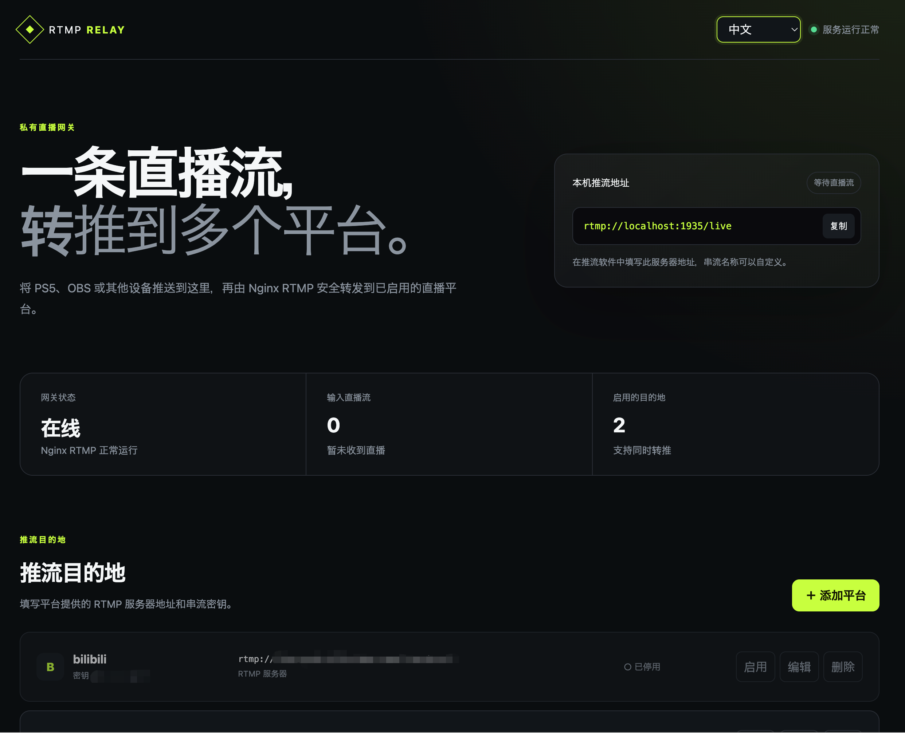
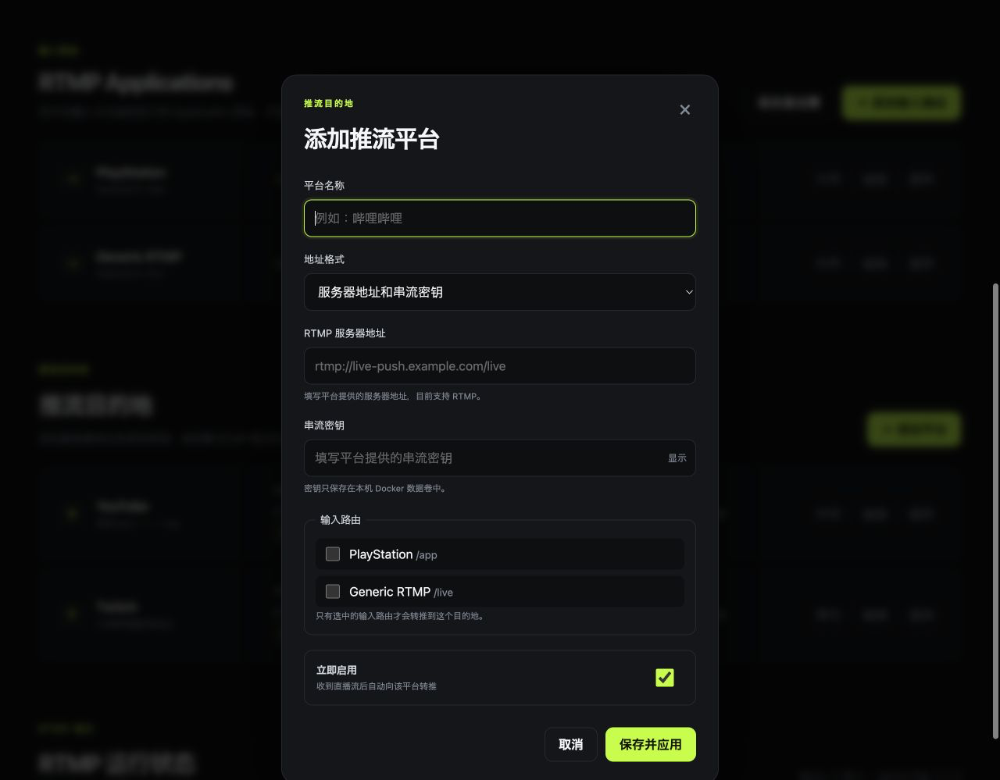

# RTMP Relay Manager

[](https://github.com/raykimurayyz/nginx-rtmp/actions/workflows/ci.yml)
[](https://hub.docker.com/r/raykimurayyz/nginx-rtmp)
[](https://hub.docker.com/r/raykimurayyz/nginx-rtmp/tags)
[](LICENSE)

[English README](README.md) · [Docker Hub](https://hub.docker.com/r/raykimurayyz/nginx-rtmp)

> **需要将 PS5 直播转推到其他平台？** 请查看 [Game Live Bridge](https://github.com/raykimurayyz/game-live-bridge)。它是一套完整的 Docker Compose 方案，整合了本地 DNS 重定向、RTMP 转推和直播弹幕转发。

一个可自行部署的 NGINX RTMP 可视化管理工具。通过浏览器管理多个 RTMP Application 输入路由及其转推目的地，可接收 PlayStation 推流方案、OBS、摄像机、硬件编码器及其他支持 RTMP 的视频源。



## 为什么使用它？

- **管理多组输入路由。** PlayStation 劫持方案可以使用 `/app`，普通推流端可以使用 `/live`，也可以创建自己的 Application 路径。
- **每路独立转推。** 不同 Application 可以绑定不同直播平台。
- **不需要手动编辑 NGINX。** 在网页中添加、编辑、启用、停用或删除转推目的地。
- **随时查看直播状态。** 监控输入/输出码率、累计流量、媒体参数、活动流和 RTMP 连接。
- **升级镜像不丢配置。** 目的地和串流密钥保存在 Docker 管理的数据卷中，不在可随时替换的容器内。
- **支持多语言。** 首次打开时自动识别英文、日文或简体中文。
- **完全自托管。** 不需要云端账号或外部控制服务。

## 工作方式

```text
PlayStation /app ──┐                         ┌──> 抖音
OBS /live ─────────┼──> RTMP Relay Manager ──┼──> 斗鱼
摄像机 /camera ────┘                         └──> 其他平台
```

每条输入路由都可以独立绑定一个或多个转推目的地，因此同一路输入流能够同时转推到多个已启用的直播平台。

应用使用 NGINX 和 nginx-rtmp-module 传输直播流，并通过轻量管理服务提供路由配置、参数检查、安全重载、配置恢复和运行状态。新安装默认启用 `app` 和 `live` 两条输入路由，但在页面绑定目的地前不会向外转推。

游戏主机通常需要通过兼容的采集卡、直播软件或硬件编码器接入。能否原生填写自定义 RTMP 地址，取决于具体主机和所使用的软件。

## 快速启动

需要 Docker Engine 24 或更高版本，或者安装了 Docker Compose v2 的 Docker Desktop。

### Docker Compose（推荐）

创建 `compose.yaml`：

```yaml
services:
  nginx-rtmp:
    image: raykimurayyz/nginx-rtmp:latest
    container_name: nginx-rtmp
    restart: unless-stopped
    ports:
      - "1935:1935"
      - "8080:8080"
    volumes:
      - nginx-rtmp-data:/data
    read_only: true
    tmpfs:
      - /tmp:rw,noexec,nosuid,size=64m
    security_opt:
      - no-new-privileges:true
    cap_drop:
      - ALL

volumes:
  nginx-rtmp-data:
```

启动容器：

```bash
docker compose up -d
```

### Docker 命令行

```bash
docker volume create nginx-rtmp-data

docker run -d \
  --name nginx-rtmp \
  --restart unless-stopped \
  --security-opt no-new-privileges:true \
  --cap-drop ALL \
  --read-only \
  --tmpfs /tmp:rw,noexec,nosuid,size=64m \
  -p 1935:1935 \
  -p 8080:8080 \
  -v nginx-rtmp-data:/data \
  raykimurayyz/nginx-rtmp:latest
```

打开管理页面：

```text
http://你的Docker主机IP:8080
```

## 开始直播

### 1. 检查或创建输入路由

默认输入路由：

- **PlayStation** — `rtmp://你的Docker主机IP:1935/app`
- **Generic RTMP** — `rtmp://你的Docker主机IP:1935/live`

可以在页面中添加、编辑、启用或删除路由。需要使用 OBS 或 VLC 拉取输入流时，请开启“允许本地拉流”。

### 2. 添加直播平台

打开管理页面，点击 **添加平台**，填写直播平台提供的两个参数：

- 平台分别提供的 **RTMP 服务器地址和串流密钥**；或者
- 已经包含密钥或查询参数的 **完整 RTMP 推流地址**。

选择需要绑定的输入路由，启用并保存目的地。



### 3. 配置推流端

填写以下输入参数：

```text
服务器：  rtmp://你的Docker主机IP:1935/live
串流密钥：main
```

本地串流密钥可以是任意自定义流名称，它和直播平台串流密钥不是同一个参数。PlayStation Twitch 劫持方案会推向 `app` Application，并通常自动提供类似 `live_...` 的动态串流名称。

### 4. 开始推流

从 OBS 或其他推流端开始直播后，RTMP Relay Manager 会自动把输入流转发到所有已启用的目的地。管理页面每 5 秒刷新一次流量和连接信息。

如果在输入流已连接时修改了转推目的地，请重新连接一次推流端，以确保新配置生效。

## 管理界面

管理页面可以显示：

- NGINX 和 RTMP 服务状态
- 当前活动的输入流及持续时间
- 整体和单路流的输入/输出码率
- 累计接收和发送流量
- 视频编码、Profile、Level、分辨率和帧率
- 音频编码、Profile、采样率、声道数和码率
- RTMP 连接类型、状态、时长、丢帧和音画同步
- 默认脱敏的客户端 IP，以及临时显示完整 IP 的按钮
- 英文、日文和简体中文自动识别与切换

选中的界面语言保存在当前浏览器中。“显示完整 IP”不会被记住，刷新页面后会恢复脱敏。

## 配置持久化与升级

输入路由、服务器参数、转推目的地和密钥保存在 `/data/config.json`。系统还会保留上一份有效配置 `/data/config.json.backup` 用于自动恢复。Version 1 配置会在首次启动时自动迁移。

升级 Compose 部署：

```bash
docker compose pull
docker compose up -d
```

除非确定要删除已保存的配置，否则不要执行 `docker compose down -v`。

NGINX 连接目的地时必须使用串流密钥，因此密钥会以明文保存在 Docker 数据卷中。请保护 Docker 主机及其数据卷。

## 端口

| 端口 | 用途 |
| --- | --- |
| `1935/tcp` | 接收 OBS、游戏主机推流方案、摄像机、编码器或其他支持 RTMP 的视频源 |
| `8080/tcp` | 网页管理界面和 API |

NGINX 原始状态接口只监听容器内部回环地址，不会发布到宿主机。

## 镜像标签和平台

支持的平台：

- `linux/amd64`
- `linux/arm64`

发布的镜像标签：

- `latest` — 最近发布的稳定版本
- `vX.Y.Z` — 不可变的应用版本，例如 `v0.2.0`

如果需要可复现部署，建议使用完整版本标签，不要使用 `latest`。

## 安全模型与限制

本项目按照设计不提供登录页面，仅适合在可信局域网中使用。不要将 `8080` 端口直接暴露到公网。

已提供的保护：

- 容器使用非 root 用户运行
- 示例配置启用 `no-new-privileges` 并移除 Linux capabilities
- 检查平台名称、RTMP 地址、串流密钥、ID 和请求大小
- 重载前执行 `nginx -t`，失败时恢复原配置
- 串流密钥默认脱敏，保存后不会再通过配置 API 返回完整密钥
- 管理界面响应包含 HTTP 安全头
- NGINX 原始统计接口只在容器内部开放

当前限制：

- 转推目的地必须使用普通 `rtmp://` 地址。
- 暂不包含 RTMPS、SRT、转码和平台特有签名。
- RTMP 连接存在不代表目的地平台已通过审核或已公开开播。

## 从源码构建

仓库内的 Compose 文件用于构建当前本地源码：

```bash
docker compose up -d --build
```

运行不需要安装第三方依赖的 Python 测试：

```bash
python3 -m unittest discover -s tests -v
```

项目结构：

```text
app/server.py          管理 API、配置保存、NGINX 检查和重载
app/static/            网页管理界面
nginx/nginx.conf       固定的 NGINX 基础配置和动态路由引用
tests/                 单元测试
.github/workflows/     CI 和 Docker Hub 镜像发布
Dockerfile             可复现的上游组件构建和运行镜像
docker-compose.yml     本地源码构建部署
```

Docker Hub 发布流水线只会由严格的 `vX.Y.Z` Git 标签或手动执行触发。推送或合并到 `main` 不会发布镜像。

## 上游组件

本项目不存放、不修改 NGINX 或 nginx-rtmp-module 源码。只有在构建镜像时，才会下载并校验上游正式版本。

| 组件 | 版本 | 来源 |
| --- | --- | --- |
| Alpine Linux | 3.24 | Alpine 官方镜像 |
| NGINX | 1.30.4 stable | `nginx.org` 官方发布包 |
| nginx-rtmp-module | 1.2.2 | 上游正式标签对应的固定提交 |

Dockerfile 固定了下载文件的 SHA-256 和 RTMP 模块的准确提交。许可证信息参见 [THIRD_PARTY_NOTICES.md](THIRD_PARTY_NOTICES.md)。

## 许可证

本仓库的原创代码采用 [MIT License](LICENSE)。

NGINX 和 nginx-rtmp-module 属于第三方组件，分别继续遵循各自的 BSD 2-Clause 许可证，详见 [THIRD_PARTY_NOTICES.md](THIRD_PARTY_NOTICES.md)。
